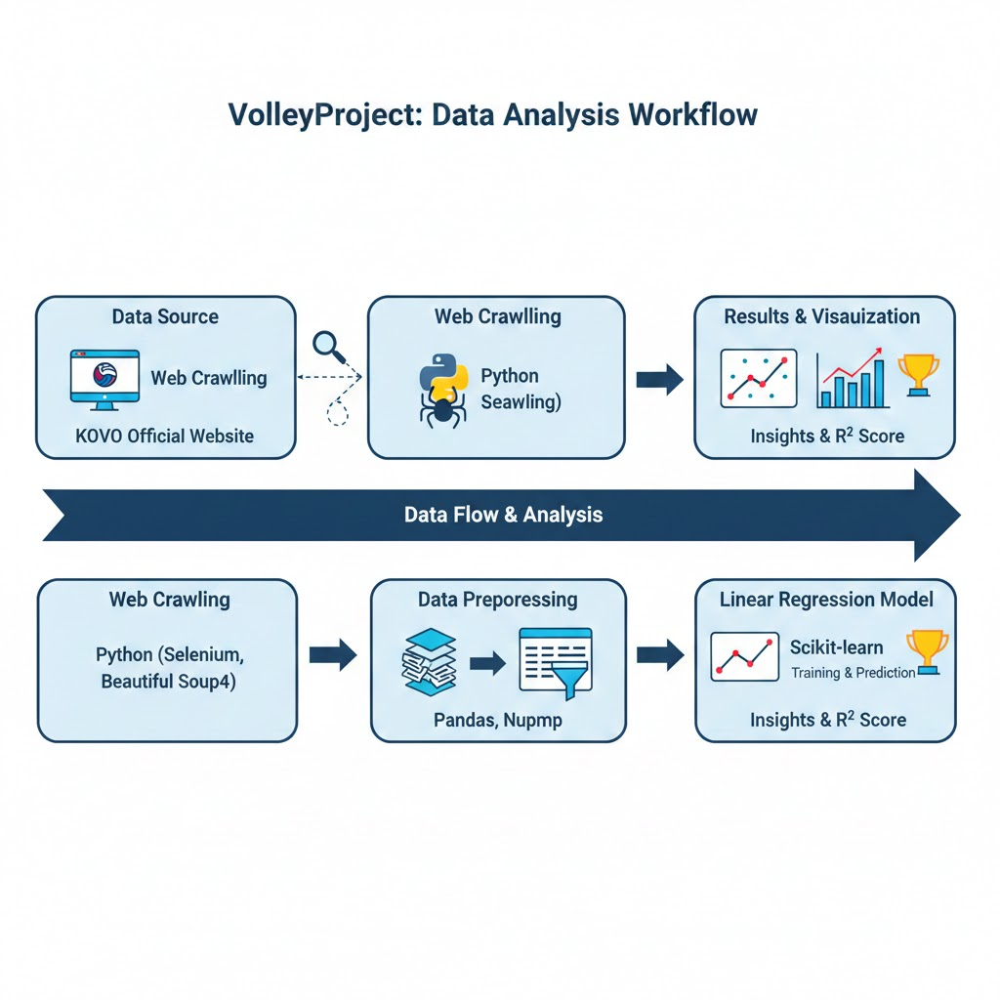

##🛠 기술 스택
Language: Python 3.x  
---Libraries---  
Selenium, BeautifulSoup4: 웹 데이터 크롤링 및 스크래핑  
Pandas, NumPy: 데이터 전처리 및 분석  
Matplotlib, Seaborn: 데이터 시각화  
Scikit-learn: 선형 회귀(Linear Regression) 모델 구축 및 평가  

graph TD

    subgraph "Data Acquisition"
        A[KOVO Official Website] --> B[Web Crawling]
        B -- "Python (Selenium, BS4)" --> C[Raw Data (CSV)]
    end

    subgraph "Data Processing"
        C --> D[Data Preprocessing]
        D -- "Pandas, NumPy" --> E[Refined Dataset]
    end

    subgraph "Machine Learning"
        E --> F[Linear Regression Model]
        F -- "Scikit-learn" --> G[Insights & R² Score]
    end

## 📊 Workflow Diagram

